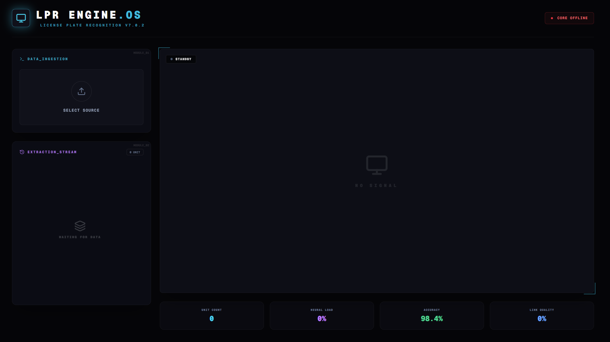

# 🚗 License Plate Recognition System

A full-stack **License Plate Recognition (LPR)** system built using **Computer Vision, FastAPI, and Next.js**.
The system detects vehicle license plates from uploaded videos, extracts plate text using OCR, streams detected plates live to the frontend using WebSockets, and generates downloadable logs and processed videos.

---

# 📌 Features

* Upload vehicle videos for processing
* AI-based license plate detection
* OCR-based plate text extraction
* Live plate detection logs via WebSockets
* Automatic CSV logging of detected plates
* Download processed video with bounding boxes
* Download CSV logs of detected plates
* GPU support for faster inference
* Modular backend architecture
* Modern Next.js frontend dashboard

---

# 🧠 Tech Stack

## Backend

* Python
* FastAPI
* OpenCV
* YOLO (License Plate Detection)
* PaddleOCR (Text Recognition)
* WebSockets
* Uvicorn

## Frontend

* Next.js
* React
* Tailwind CSS

---

# 🏗 Project Structure

```text
project-root
│
├── Backend
│   │
│   ├── server.py
│   ├── requirements.txt
│   │
│   ├── models
│   │   └── ai_models.py
│   │
│   ├── production_models
│   │   ├── yolo_plate_model.pt
│   │   └── paddle_ocr_models
│   │
│   ├── routes
│   │   └── upload_routes.py
│   │
│   ├── services
│   │   └── video_service.py
│   │
│   ├── utils
│   │   └── plate_utils.py
│   │
│   ├── check
│   │   ├── check_cpu.py
│   │   ├── check_gpu.py
│   │   └── check_cuda.py
│   │
│   └── temp
│       ├── input_video.mp4
│       ├── detected_output.mp4
│       └── plates_log.csv
│
└── Frontend
    ├── .env.local
    ├── package.json
    ├── next.config.js
    ├── app
    ├── components
    └── public
        └── ui-preview.png
```

---

# 🧠 Model Training

Dataset and training notebook are available on Kaggle:

https://www.kaggle.com/datasets/rohanvenkatesha/indian-license-plates

The trained models used for inference are stored inside:

```
Backend/production_models/
```

---

# ⚙️ Backend Setup (FastAPI)

### 1️⃣ Navigate to Backend

```bash
cd Backend
```

---

### 2️⃣ Create Virtual Environment

```bash
python -m venv venv
```

Activate environment

**Windows**

```bash
venv\Scripts\activate
```

**Mac / Linux**

```bash
source venv/bin/activate
```

---

### 3️⃣ Install Dependencies

```bash
pip install -r requirements.txt
```

---

### 4️⃣ Run FastAPI Server

```bash
uvicorn server:app --reload
```

Backend will run at

```
http://localhost:8000
```

---

# ⚙️ Frontend Setup (Next.js)

### 1️⃣ Navigate to Frontend

```bash
cd Frontend
```

---

### 2️⃣ Install Dependencies

```bash
npm install
```

or

```bash
yarn install
```

---

### 3️⃣ Run Development Server

```bash
npm run dev
```

Frontend will run at

```
http://localhost:3000
```

---

# 🔑 Environment Variables

Create the following file in the **root of the Frontend folder**

```
Frontend/.env.local
```

Add:

```env
NEXT_PUBLIC_BACKEND_URL=http://localhost:8000
NEXT_PUBLIC_WS_URL=ws://localhost:8000/ws
```

### Example Production Configuration

```env
NEXT_PUBLIC_BACKEND_URL=https://your-production-backend.com
NEXT_PUBLIC_WS_URL=wss://your-production-backend.com/ws
```

---

# 🌐 Backend CORS Configuration

Update the **CORS origins** inside:

```
Backend/server.py
```

Example configuration:

```python
from fastapi.middleware.cors import CORSMiddleware

origins = [
    "http://localhost:3000"
]

app.add_middleware(
    CORSMiddleware,
    allow_origins=origins,
    allow_credentials=True,
    allow_methods=["*"],
    allow_headers=["*"],
)
```

For production deployment:

```python
origins = [
    "https://your-frontend-domain.com"
]
```

---

# 🔌 API Endpoints

## Health Check

```
GET /
```

Response

```json
{
 "status": "ok",
 "message": "License Plate Recognition API is running"
}
```

---

## Upload Video

```
POST /upload-video
```

Supported formats:

* MP4
* MOV
* AVI
* MKV

---

## WebSocket (Live Plate Detection)

```
ws://localhost:8000/ws
```

Example streamed message:

```json
{
 "plate": "KA01AB1234",
 "timestamp": "2026-03-10 14:23:12"
}
```

When processing completes:

```json
{
 "type": "video_complete"
}
```

---

# 📊 Processing Flow

```
User uploads video
        │
        ▼
FastAPI receives video
        │
        ▼
Video saved to temp folder
        │
        ▼
YOLO detects license plates
        │
        ▼
PaddleOCR extracts text
        │
        ▼
Plates streamed via WebSocket
        │
        ▼
CSV log updated
        │
        ▼
Processed video generated
```

---

# ⚡ GPU Support (Optional)

If your system supports **CUDA**, you can run the models on GPU.

### Install PyTorch GPU version

Example for CUDA 12.1:

```bash
pip install torch torchvision torchaudio --index-url https://download.pytorch.org/whl/cu121
```

---

### Install PaddlePaddle GPU

Example for CUDA 11.8:

```bash
pip install paddlepaddle-gpu==2.6.2.post118 -f https://www.paddlepaddle.org.cn/whl/linux/mkl/avx/stable.html
```

---

# 🧠 Enable GPU in PaddleOCR

Open:

```
Backend/models/ai_models.py
```

Modify the PaddleOCR initialization:

```python
ocr = PaddleOCR(
    use_angle_cls=True,
    lang="en",
    use_gpu=True
)
```

---

# 🖥 Hardware Check Utilities

Inside the backend there is a **check folder** used to verify system hardware before running the models.

```
Backend/check/
```

Scripts included:

```
check_cpu.py
check_gpu.py
check_cuda.py
```

These scripts help verify whether your system supports GPU acceleration.

---

# 🖥 UI Preview



---

# 📂 Temporary Files

Temporary files generated during processing are stored in:

```
Backend/temp/
```

Example:

```
temp/
   input_video.mp4
   detected_output.mp4
   plates_log.csv
```

---

# 🧪 Example Use Cases

* Smart traffic monitoring
* Parking lot vehicle tracking
* Toll booth automation
* Security surveillance
* Vehicle access control systems

---

# 🚀 Future Improvements

* Real-time CCTV stream processing
* Multiple camera support
* Database storage for plate logs
* Vehicle analytics dashboard
* Cloud deployment
* Multi-user job processing

---

# 👨‍💻 Author

**Rohan**
Software Engineer
https://rohanvenkatesha.vercel.app/

---

# 📜 License

This project is released under the **MIT License**.
